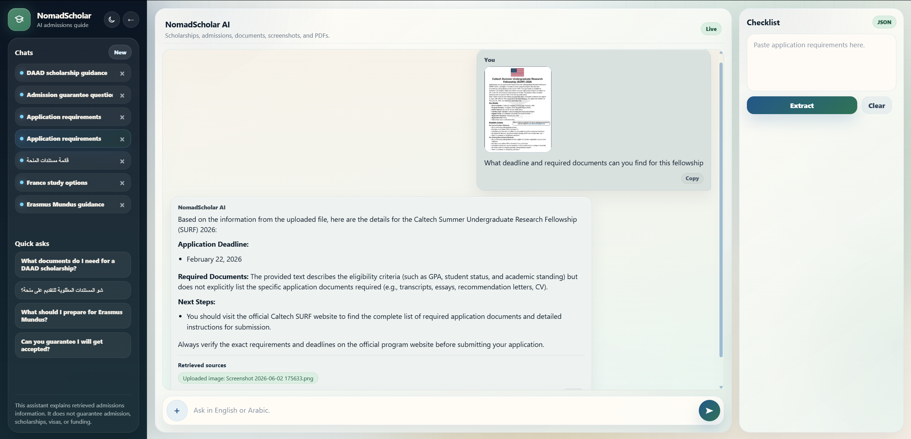
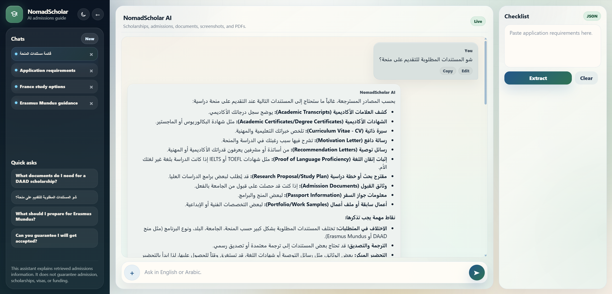
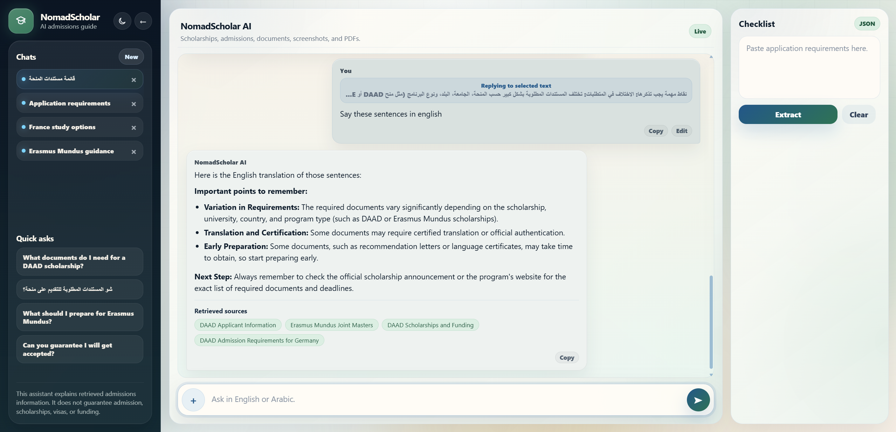
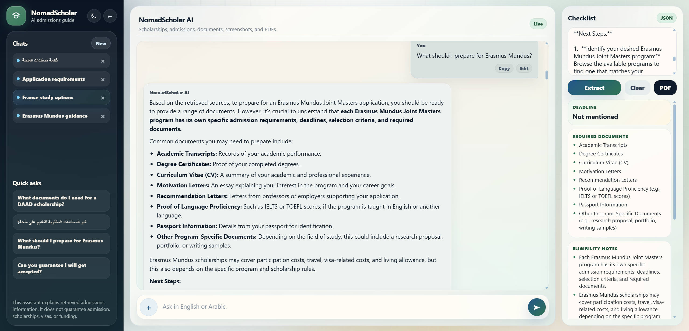

# NomadScholar AI - RAG Admissions Assistant

NomadScholar AI is a bilingual multimodal RAG assistant for scholarship and university application guidance. It helps students ask admissions questions in English or Arabic, retrieve grounded answers from a curated knowledge base, upload screenshots or digital PDFs, and turn application requirements into structured checklists.

This project was built as the final capstone for the **Large Language Models** course in the **Artificial Intelligence & Data Science Graduate Professional Diploma at the American University of Beirut (AUB)**, Spring 2025-2026.

## Screenshots

### Image OCR Answering



### Arabic RAG Answer



### Selected-Text Reply



### Structured Checklist Extraction



## Course Requirement Mapping

| Requirement | Implementation |
| --- | --- |
| Knowledge base | 10 curated guidance files from Campus France, Common App, DAAD, EducationUSA, and Erasmus Mundus |
| RAG storage | ChromaDB vectorstore with HuggingFace multilingual sentence-transformer embeddings |
| LLM pipeline | LangChain prompt pipeline using Gemini for conversational answers |
| Conversation memory | Frontend sends previous conversation turns to the backend for multi-turn context |
| Prompt engineering | Role prompt, grounding rules, safety rules, and few-shot English/Arabic examples |
| Multimodal input | Image OCR with EasyOCR/OpenCV, plus digital PDF text extraction with PyPDF |
| Structured output | Pydantic checklist schema for deadlines, documents, eligibility notes, missing information, and next steps |
| UI | React/Vite chat interface with uploads, sources, local chat history, selected-text replies, edit/copy actions, and checklist export |
| Testing | 26 documented test cases and 5 documented RAG improvement cases |

## Key Features

- Bilingual chat assistant for English and Arabic admissions/scholarship questions
- Retrieval-augmented generation over curated official-source knowledge files
- FastAPI backend with chat, file upload, image upload, and checklist endpoints
- React/Vite frontend with multi-chat local history, edit/regenerate, copy actions, stop generation, and file attachments
- ChromaDB vectorstore with HuggingFace multilingual embeddings
- Gemini LLM integration through LangChain
- OCR support for PNG/JPG/JPEG screenshots using EasyOCR and OpenCV preprocessing
- Digital PDF text extraction using PyPDF
- Structured checklist extraction with Pydantic output fields
- Checklist PDF export, including Arabic-friendly PDF rendering
- Safety guardrails for admission, visa, scholarship, and funding guarantees

## Tech Stack

### Backend

- Python
- FastAPI
- LangChain
- ChromaDB
- HuggingFace sentence-transformer embeddings
- Google Gemini
- Pydantic
- EasyOCR
- OpenCV
- PyPDF

### Frontend

- React
- Vite
- React Markdown
- jsPDF
- LocalStorage and SessionStorage for chat persistence

## Project Structure

```text
.
|-- api.py                         # FastAPI app and API routes
|-- ingest.py                      # Loads source files and builds the Chroma vectorstore
|-- rag_chain.py                   # Retrieval, prompt construction, LLM calls, and safety routing
|-- ocr_utils.py                   # Image OCR and digital PDF text extraction helpers
|-- prompts.py                     # System prompt and answer template
|-- structured_outputs.py          # Pydantic checklist schema
|-- requirements.txt               # Backend dependencies
|-- data/                          # Curated knowledge base text files
|-- tests/
|   |-- test_questions.md          # 26 documented evaluation tests
|   |-- rag_improvement_cases.md   # 5 documented retrieval-improvement cases
|   |-- test_ocr.py                # Manual OCR smoke-test script
|   `-- test_retrieval.py          # Manual retrieval smoke-test script
|-- assets/screenshots/            # README and report screenshots
|-- report/                        # Final project report PDF
`-- frontend/                      # React/Vite user interface
```

`vectorstore/`, `.venv/`, `frontend/node_modules/`, and `frontend/dist/` are generated locally and are intentionally not committed.

## Setup

### 1. Clone the Repository

```bash
git clone https://github.com/joeElieSarkis/nomadscholar-rag-assistant.git
cd nomadscholar-rag-assistant
```

### 2. Backend Setup

Create and activate a virtual environment:

```bash
python -m venv .venv
```

On Windows:

```bash
.venv\Scripts\activate
```

Install backend dependencies:

```bash
pip install -r requirements.txt
```

Create a local environment file:

```bash
copy .env.example .env
```

Add your Gemini API key to `.env`:

```env
GOOGLE_API_KEY=your_google_api_key_here
GEMINI_MODEL=gemini-2.5-flash
```

Do not commit `.env`. It contains private credentials.

### 3. Build the Vectorstore

```bash
python ingest.py
```

This loads the curated files in `data/`, chunks them, embeds them, and stores them in the local Chroma vectorstore.

### 4. Start the Backend

```bash
uvicorn api:app --reload
```

Backend API:

```text
http://127.0.0.1:8000
```

FastAPI docs:

```text
http://127.0.0.1:8000/docs
```

### 5. Frontend Setup

Open a second terminal:

```bash
cd frontend
npm install
npm run dev
```

Frontend app:

```text
http://localhost:5173
```

The frontend already defaults to `http://127.0.0.1:8000`. Only create a frontend `.env` file if your backend is running somewhere else:

```bash
copy frontend\.env.example frontend\.env
```

```env
VITE_API_BASE_URL=http://127.0.0.1:8000
```

## Usage

Ask questions such as:

```text
What documents do I need for a DAAD scholarship?
```

```text
شو المستندات المطلوبة للتقديم على منحة؟
```

```text
I want to apply for a master's in AI in France. What options should I explore?
```

You can also upload:

- PNG/JPG/JPEG screenshots for OCR-based analysis
- digital PDFs with selectable text

The checklist panel extracts:

- deadline
- required documents
- eligibility notes
- missing information
- next steps

## API Endpoints

| Endpoint | Purpose |
| --- | --- |
| `GET /` | Health check and API metadata |
| `POST /api/chat` | Text-only RAG chat |
| `POST /api/chat-with-image` | Backward-compatible image upload endpoint |
| `POST /api/chat-with-file` | Image or digital PDF upload with RAG answer |
| `POST /api/checklist` | Structured checklist extraction from pasted text |

## Testing

Detailed testing documentation is available in:

- [`tests/test_questions.md`](tests/test_questions.md) - 26 documented evaluation tests covering in-scope, Arabic, multimodal, memory, structured output, safety, and out-of-scope cases.
- [`tests/rag_improvement_cases.md`](tests/rag_improvement_cases.md) - 5 documented cases showing how retrieval improved response quality and grounding.

Optional manual smoke-test scripts:

```bash
python tests/test_retrieval.py
python tests/test_ocr.py
```

## Report

The final course report is available here:

[`report/NomadScholar_AI_Project_Report_Joe_Sarkis.pdf`](report/NomadScholar_AI_Project_Report_Joe_Sarkis.pdf)

## Safety Behavior

NomadScholar AI does not guarantee:

- admission
- scholarships
- visas
- funding
- application outcomes

When asked guarantee-related questions, the assistant explains that final decisions are made by official universities, scholarship providers, embassies, or application platforms.

## Limitations

- The knowledge base is curated and local, so it does not automatically search the live web.
- Answers are grounded in retrieved local documents and uploaded file text.
- Digital PDF upload works best for PDFs with selectable text.
- Scanned PDFs that are only images may require future page-rendering OCR support.
- OCR quality depends on screenshot quality, image resolution, font clarity, and language.
- The system provides guidance, not official decisions.
- Gemini API free-tier quota limits may temporarily block generation during heavy testing.

## Future Improvements

- Add scanned PDF OCR by rendering PDF pages into images and applying OCR.
- Add chunk-level inline citations beside specific claims.
- Add optional live web retrieval for fresh program and deadline lookup.
- Add user authentication and cloud chat storage.
- Add speech-to-text input for voice questions.
- Add deployment using Docker and a cloud hosting provider.
- Add downloadable application plans beyond checklist PDFs.

## Git Notes

Recommended files to commit:

```text
api.py
ingest.py
rag_chain.py
ocr_utils.py
prompts.py
structured_outputs.py
requirements.txt
data/
tests/
assets/screenshots/
report/NomadScholar_AI_Project_Report_Joe_Sarkis.pdf
frontend/
.env.example
frontend/.env.example
README.md
```

Files that should not be committed:

```text
.env
.venv/
__pycache__/
vectorstore/
frontend/node_modules/
frontend/dist/
*.mp4
```

## License

This project is for academic use as part of the AUB AI & Data Science Graduate Professional Diploma LLM course capstone.
